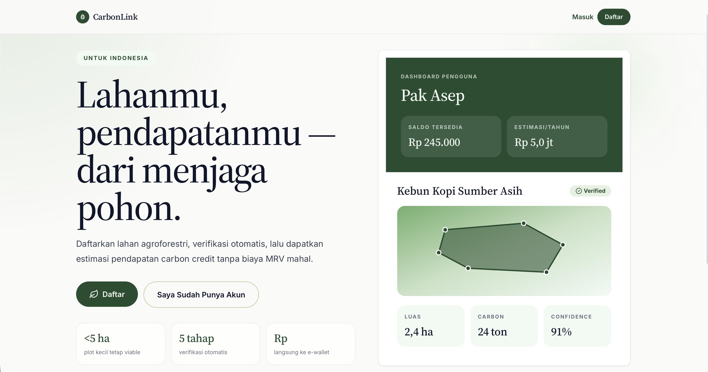

# CarbonLink

Carbon Link is an open-source platform that democratizes access to carbon markets for smallholder farmers in Indonesia by automating the Measurement, Reporting, and Verification (MRV) process through satellite imagery analysis and AI-powered land cover detection. Smallholder farmers who collectively practice agroforestry across millions of hectares of Indonesian land have historically been excluded from the global carbon credit market due to verification costs that can exceed $50,000 per project, making participation feasible only for large corporate concessions. This platform reduces that barrier by allowing farmers to register their land via a mobile app, after which satellite data and machine learning models automatically verify tree cover, carbon sequestration estimates, and sustainable land practices generating tokenized carbon credits that can be traded on voluntary domestic or international markets and paid out directly to farmers through e-wallets. By collapsing the cost of MRV from tens of thousands of dollars to a fraction of that per farmer, KarbonKredit Mikro aims to redirect carbon finance toward the communities that need it most while creating direct economic incentives to protect forests from conversion to palm oil plantations.


## Features
### Implemented

- **Land Registration**         : Petani mendaftarkan lahan langsung dari aplikasi
- **Automated MRV**             : Verifikasi lahan otomatis menggunakan satelit & AI
- **Carbon Estimation**         : Perhitungan serapan karbon berbasis model ML
- **Carbon Credit Generation**  : Kredit karbon dibuat secra digital dari hasil verifikasi

### Upcoming
- **Backend Integration** : Integrasi seluruh alur ke sistem backend terpusat
- **Detection Model Pipeline** : Integrasi model AI untuk detection system
- **Carbon Calculation Engine** : Perhitungan karbon yang lebih akurat & scalable

## Tech Stack
- Frontend  : Next.js, TailwindCSS, React, TypeScript
- Backend   : Next.js API Routes, Prisma
- Database  : Prisma ORM
- Tools     : pnpm, PostCSS, ESLint


<!-- ## Getting Started

First, run the development server:

```bash
npm run dev
# or
yarn dev
# or
pnpm dev
# or
bun dev
``` -->
